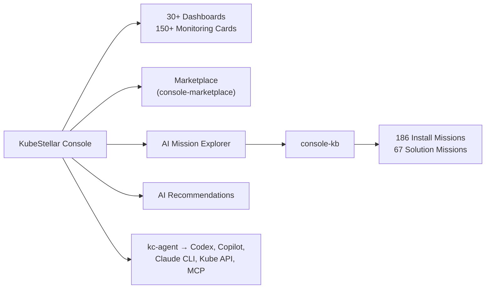

# KubeStellar Console

AI-powered multi-cluster Kubernetes dashboard with guided install missions for 250+ CNCF projects.

[**Live Demo**](https://console.kubestellar.io) | [Contributing](CONTRIBUTING.md) | [License](LICENSE)


## Architecture



- **[console-kb](https://github.com/kubestellar/console-kb)** — YAML knowledge base defining mission steps, commands, and validation checks
- **[console-marketplace](https://github.com/kubestellar/console-marketplace)** — Community-contributed monitoring cards per CNCF project
- **[kc-agent](cmd/kc-agent/)** — Local agent bridging the browser to kubeconfig, coding agents (Codex, Copilot, Claude CLI), and MCP servers (`kubestellar-ops`, `kubestellar-deploy`)

## Install

```bash
curl -sSL https://raw.githubusercontent.com/kubestellar/console/main/start.sh | bash
```

Opens at [localhost:8080](http://localhost:8080). Deploy into a cluster with [`deploy.sh`](deploy.sh) (`--openshift`, `--ingress <host>`, `--github-oauth`, `--uninstall`).

**kc-agent** connects [console.kubestellar.io](https://console.kubestellar.io) to your local clusters:

```bash
brew tap kubestellar/tap && brew install --head kc-agent   # macOS
go build -o bin/kc-agent ./cmd/kc-agent && ./bin/kc-agent  # Linux (Go 1.24+)
```

## How It Works

1. **Onboarding** — Sign in with GitHub, answer role questions, get a personalized dashboard
2. **Adaptive AI** — Tracks card interactions and suggests swaps when your focus shifts (Claude, OpenAI, or Gemini)
3. **MCP Bridge** — Queries cluster state (pods, deployments, events, drift, security) via `kubestellar-ops` and `kubestellar-deploy`
4. **Missions** — Step-by-step guided installs with pre-flight checks, validation, troubleshooting, and rollback
5. **Real-time** — WebSocket-powered live event streaming from all connected clusters

## Development

Requires Go 1.24+, Node.js 20+.

```bash
git clone https://github.com/kubestellar/console.git && cd console
./start-dev.sh
```

```
console/
├── cmd/console/       # Server entry point
├── cmd/kc-agent/      # Local agent
├── pkg/agent/         # AI providers (Claude, OpenAI, Gemini)
├── pkg/api/           # HTTP/WS server + handlers
├── pkg/mcp/           # MCP bridge to Kubernetes
├── pkg/store/         # SQLite database layer
├── web/               # React + TypeScript frontend
└── deploy/helm/       # Helm chart
```

## Related Projects

[console-kb](https://github.com/kubestellar/console-kb) · [console-marketplace](https://github.com/kubestellar/console-marketplace) · [claude-plugins](https://github.com/kubestellar/claude-plugins) · [homebrew-tap](https://github.com/kubestellar/homebrew-tap) · [KubeStellar](https://kubestellar.io)

## License

Apache License 2.0 — see [LICENSE](LICENSE).
